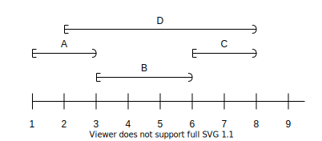

# 第二部 ループとロジックの単純化

第I部では、コードの **1行ずつ** を読みやすくするような改善であった。<br>
第II部では、プログラムの **ループとロジック** 部分の改善を取り上げる。

第II部の概要：<br>
複雑なループ・巨大な式・膨大な変数を見ると、頭の中で記憶しなければならない。<br>
それは、「理解しやすい」のとは正反対。<br>
そういった **精神的な荷物（記憶しなければならない行為）** を減らして、コードを読みやすくする。

# 7章　制御フローを読みやすくする

鍵となる考え：<br>
条件やループなどの制御フローはできるだけ**自然**にする。<br>
コードの読み手が **立ち止まったり読み返したりしない** ように書く。

## 7.1　条件式の引数の並び順

どちらが読みやすい？

```.js
if　(length >= 10)
または
if　(10 <= length)
```

```.js
while (bytes_received < bytes_expected)
または
while (bytes_expected > bytes_received)
```

**左辺が調査対象（変数）** 、 **右辺が比較対象（定数）** とするほうが読みやすい。<br>
英文章として読む際も自然。

## 7.2　if/elseブロックの並び順

ポイント：
* 否定形よりも肯定系を使う
* 単純な条件を先に書く
* **関心を引く条件** を先に処理する

どちらが読みやすい？

```.js
if (!url.HasQueryParameter("expand_all")) {  // "expand_all"って何のこと？？
    // expand_allのことが頭にちらつく...（しかしここでは出てこない）
} else {
    // ここでやっとexpand_allが登場する...（ずっと頭に浮かんでしまって大変だった）
}
```

または

```.js
if (url.HasQueryParameter("expand_all")) {
    // 先にexpand_allを扱う処理を行ってしまえば、
} else {
    // もうexpand_allのことは忘れて良くなる
}
```

後者の方が、 **精神的な荷物（記憶しなければならない行為）** が少ない分、読みやすい。

## 7.3　行数を短くするよりも、他人が理解するのにかかる時間を短くする

鍵となる考え：<br>
行数を短くするよりも、他の人が理解するのにかかる時間を短くする。

ポイント：
* 基本的にはif/else文を使う
* 三項演算子は、それによって簡潔になるときにだけ使う

例えば、単純な2つの値から1つを選ぶような場合は、三項演算子のほうが読みやすい。

## 7.4　do/whileループを避ける

do/whileは条件式が最初に出てこないので不自然さがある。結果的に、コードを2回読むことになる。<br>
do/whileループはwhileループで書き直せることが多い。

ビャーネ・ストロヴストルップ（C++の作者）の著書『C++ Programming Language』での言葉：
> 私の経験では、do-statementは、エラーや混乱の原因になることが多い。（中略）
私は条件が「前もって」書かれている方が好きだ。
そのため、私はdo-statementを避けることが多い。

## 7.5　関数から早く返す

関数で複数のreturn文を使ってはいけないなんてことはない（むしろ望ましい時もある）。

しかし、関数の出口を1つにしたい（returnを一度だけにしたい）ような場合がないわけでもない。
* 例：何らかのクリーンアップコードを確実に実行したい場合
* ただし、Java、Python、C#などでは関数の終了時に特定の処理を呼び出すような機能が存在するので、そちらを積極的に使うと良い

Javaの try...finally イディオムの例：
```.java
try{
    // 通常実行したい処理
}
catch (例外クラス 変数名){
    // 例外発生時に実行したい処理
}
finally {
    // 例外が発生するしないに関わらず最後に必ず実行される処理
}
```

## 7.6　悪名高きgoto

C言語以外では、gotoはほとんど使わない（同じことをする方法がいくらでもあるから）。<br>
gotoを使うとすぐに手に負えなくなったり、コードについていくのが難しくなる。<br>
特に、gotoの飛び先が複数になると大変。
* 経路が交差してしていたらなおさら
* gotoで上に飛ぶと途端にスパゲッティコードになる

基本的にはgotoは使わない方がいい。

最も単純で害のないgotoの例：
```
    if (p == NULL) goto exit;
    ...
exit:
    fclose(file1);
    fclose(file2);
    ...
    return;
```

## 7.7　ネストを浅くする

読み手がネストを辿る際の辛さ：
* ネストを1つ下がる度に、読み手は条件式を記憶にスタックしなければならない
* ネストを1つ出る度に、読み手は条件式を記憶からポップしなければならない

ネストが増える仕組み：
* 最初は単純なコード
* しかし、後に追加されたコードによってネストが深くなることがある

**早めに返してネストを削除する**：
* ネストを削除するには、「失敗ケース」をできるだけ早めに関数から返せばいい

例（変更前）：
```.js
if (user_result == SUCCESS) {
    if (permission_result != SUCCESS) {  // ケース①
        reply.WriteErrors("error reading permissions");
        reply.Done();
        return;
    }
    reply.WriteErrors("");  // ケース②
} else {
    reply.WriteErrors(user_result);  // ケース③
}
reply.Done();  // ケース①②③共通
```

例（変更後）：
```.js
if (user_result != SUCCESS) {  // ケース③から返す
    reply.WriteErrors(user_result);
    reply.Done();
    return;
}

if (permission_result != SUCCESS) {  // ケース①を返す
    reply.WriteErrors(permission_result);
    reply.Done();
    return;
}

// ケース②を返す
reply.WriteErrors(""); 
reply.Done();
```

ネストの深さが2レベルから1レベルになった

## 7.8　実行の流れを終えるかい？

以下の構成要素が、コードの全体に占める割合において大きくなるほど、コードは読みにくくなる
* スレッド
* シグナル／割り込みハンドラ
* 例外
* 関数ポインタと無名関数
* 仮想メソッド

## 7.9　まとめ

コードの処理フローを読みやすくするためにできること：
* ifやwhileの条件式の書き方(変数を左辺に、定数を右辺にする)
* if/elseでは、肯定形をifの条件式に持っていく
* if/elseでは、関心を引く条件を先に処理する
* 三項演算子・do/while・gotoなどはコードが読みにくくなるのでできるだけ使わない
* ネストが深くなるほど記憶しなければならない条件式が増えるので、ネストは浅く保つ
* ガード節をうまく活用することで、ネストを浅く保ったり、記憶しなければならないことを減らす

# 8章　巨大な式を分割する

鍵となる考え：<br>
巨大な式は飲み込みやすい大きさに分割する。

## 8.1　説明変数

**説明変数**：式の意味を表す変数のこと。

説明変数を取り入れることで、コードが読みやすくなる。

## 8.2　要約変数

**要約変数**：大きなコードの塊を小さな名前に置き換えて、管理や把握を簡単にすること。

要約変数を追加することで、伝えたい概念を明確に表現できる。<br>
要約変数を最上部で定義することで、概念を事前に伝えることもできる。

## 8.3　ド・モルガンの法則を使う

ド・モルガンの法則：

```
not (a or b or c) ↔︎ (not a) and (not b) and (not c)
not (a and b and c) ↔︎ (not a) or (not b) or (not c)
```

ド・モルガンの法則を使って、論理式を読みやすくすることができる場合がある。

```.js
// わかりにくい
if(!(file_exists && !is_protected)) Error("Sorry,could not read file.");
// こちらのほうがわかりやすい
if(!fle_exists || is_protected) Error("Sorry,could not read file.");
```

## 8.4　短絡評価の悪用

ブール演算子における短絡評価：
* `if (a || b)` の `a` が `true` であれば `b` は評価されない
* `if (a && b)` の `a` が `false` であれば `b` は評価されない

短絡評価を使ったため読みにくくなったコードの例（たった1行だが、立ち止まって考えなくてはならない）：

```
// キーを元にバケットを取得する。バケットがnullでなければ、バケットが使用されていないかを確認する。
assert((!(bucket = FindBucket(key)) || !bucket->IsOccupied()));
```

以下のように書き換えた方が理解しやすい。

```
bucket = FindBucket(key);
if (bucket != NULL) assert(!bucket->IsOccpied());
```

鍵となる考え：<br>
「頭がいい」コードに気を付ける。あとで他の人がコードを読むときにわかりにくくなる。

何でも短絡評価を避けろというわけではなく、簡潔に使える場合は利用しても良い。<br>
例えば、 `object` がnullであれば計算をやめたい場合など。

```
if(object && object->method()) ...
```

## 8.5　例：複雑なロジックを格闘する

お題：Rangeクラスの `OverlapsWith` 関数の実装

```
suruct Range {
    int begin;
    int end;

    // 例えば、[0,5)は[3,8)と重なっている
    bool OverlapsWith(Range over);
}
```

下の図の例だと、A・B・Cは互いに重なっていないが、DはA・B・Cと重なっている。



以下は愚直に場合分けを行なって実装を完成させたコードの例：<br>（かなり複雑だし、本当に正しいかどうかも自信が持てない）

```
bool Range::OverlapsWith(Range other) {
    return (begin >= other.begin && begin < other.end) ||
           (end > other.begin && end <= other.end) ||
           (begin <= other.begin && end >= other.end);
}
```

### より優雅な手法を見つける

**問題を反対から解く**ことで、問題が簡潔になることがある。

`OverlapsWith()` の反対である「互いに重ならない」場合の条件は以下の2つしかない：

1. 一方の範囲の終点が、ある範囲の始点よりも前にある場合
2. 一方の範囲の始点が、ある範囲の終点よりも後にある場合

```
bool Range::OverlapsWith(Range other) {
    if (other.end <= begin) return false;  // 条件1  
    if (other.begin >= end) return false;  // 条件2
    return true;  // それ以外の場合は重なっている
}
```

## 8.6　巨大な文を分割する

同じ式が何度も繰り返されるようなときは、それらを要約変数として関数の最上部に抽出すればいい。<br>（[DRY原則](https://ja.wikipedia.org/wiki/Don%27t_repeat_yourself) の実例でもある）

## 8.7　式を簡潔にするもう1つの創造的な方法

フィールド名が違うだけで、同じような式を繰り返しているような場合もある。<br>
こういった場合に、C++ではマクロを使うことで解決できる。

マクロを頻繁に使えというわけではないが、簡潔で読みやすくなるような場合には利点がある。

## 8.8　まとめ

8章では、巨大な式を分割して、読み手が1つずつ飲み込めるようにする方法を紹介した。

説明変数を使う利点：

* 巨大な式を分割できる
* 簡潔な名前で式を説明することで、コードを文書化できる
* コードの主要な「概念」を読み手が認識しやすくなる

その他にも、

* ド・モルガンの法則を使う
* ガード節をうまく使う（早くreturnで関数から返す）
* 否定の場合を考えてみる

などでコードが読みやすくなる場合がある。